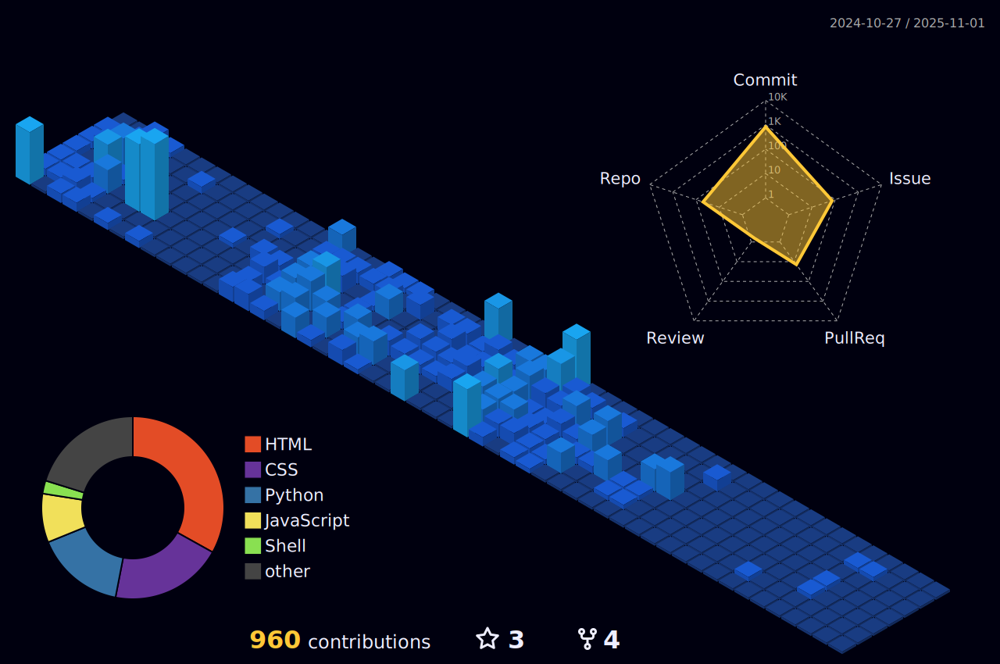

<h1 align="center">Hi!👋🏻 I'm Darien 🧑🏻‍💻</h1>

<h4 align="center">
<img src="https://readme-typing-svg.demolab.com?font=Quicksand&weight=500&size=14&letterSpacing=2px&duration=3200&pause=1000&color=EBEBFF&background=111127&vCenter=true&width=870&height=50&separator=%3C&lines=+++%F0%9F%8E%A8+Programming+is+my+canvas%2C+%26+code+is+my+brush.+Always+looking+to+create+something+unique.%3C%F0%9F%A7%A0+My+best+tool+isn%E2%80%99t+the+keyboard%2C+but+the+creativity+to+find+out-of-the-box+solutions.%3C%F0%9F%8E%B5+Coding+%26+music+have+much+in+common%E2%80%94both+require+rhythm%2C+flow+%26+creativity.%3C%F0%9F%8C%9F+I+love+challenging+the+status+quo+%26+finding+new+ways+to+do+things+better%2C+faster+%26+more+efficiently.%3C%F0%9F%92%A1+Innovation+isn%E2%80%99t+just+in+the+code;+it%E2%80%99s+in+how+we+see+issues+%26+solutions.%3C%F0%9F%94%AE+Imagining+the+future+%26+then+coding+it%E2%80%A6+that%E2%80%99s+my+way+of+making+magic.%3C%F0%9F%A4%96+I%E2%80%99m+passionate+about+AI+%26+how+technology+can+improve+the+world+(but+please%2C+no+Skynet).%3C%F0%9F%8C%8D+I+believe+technology+is+a+way+to+improve+the+world%2C+but+%E2%80%9CHello%2C+World!%E2%80%9D+is+just+the+beginning.%3C%F0%9F%9A%80+Always+learning%2C+growing+%26+seeking+opportunities+to+contribute+to+innovative+projects.%3C%F0%9F%90%8D+Building+a+strong+foundation+in+Python%2C+HTML%2C+CSS%2C+JS%2C+Git+%26+Linux+to+enhance+my+develop+skills.%3C%F0%9F%94%8D+Passionate+about+problem-solving+%26+finding+creative+solutions+through+technology.%3C%F0%9F%8C%8A+I+easily+adapt+to+change%E2%80%94like+a+wave%2C+I+flow+with+new+challenges+%26+embrace+innovation.%3C%F0%9F%9A%A6+First%2C+I+think.+Then%2C+I+code.+Avoiding+issues+at+the+design+stage+saves+a+lot+of+headaches.%3C%F0%9F%92%BB+I%E2%80%99m+always+looking+to+improve+my+code+because%E2%80%A6+everything+can+be+optimized+just+a+little+more.%3C%F0%9F%93%9C+Clean+code+isn%E2%80%99t+just+a+practice;+it%E2%80%99s+an+art.+Every+function+tells+a+story.%3C%E2%9A%99%EF%B8%8F+I+love+automating+things.+Why+does+something+twice+when+a+script+can+do+it+forever%3F%3C%F0%9F%94%8D+If+there%E2%80%99s+a+bug%2C+I%E2%80%99ll+find+it.+Not+always+fast%2C+but+I%E2%80%99ll+find+it.%3C%F0%9F%95%B9%EF%B8%8F+I+approach+coding+like+a+video+game%3A+leveling+up%2C+debugging+bosses+%26+unlocking+new+skills.%3C%F0%9F%8E%A2+Programming+is+like+a+roller+coaster%E2%80%94full+of+ups%2C+downs+%26+unexpected+loops%2C+but+I+love+the+ride.%3C%E2%9C%A8+Clean+code+isn%E2%80%99t+just+about+logic;+it%E2%80%99s+about+making+technology+feel+almost%E2%80%A6+magical.%3C%F0%9F%8C%8D+Committed+to+creating+inclusive+solutions+that+make+a+real+impact+in+the+tech+world." alt="About me: Programming is my canvas, and code is my brush. Always looking to create something unique. My best tool isn’t the keyboard, but the creativity to find out-of-the-box solutions. Coding and music have much in common (both require rhythm, flow, and creativity). I love challenging the status quo and finding new ways to do things better, faster, and more efficiently. Innovation isn’t just in the code; it’s in how we see issues and solutions. Imagining the future and then coding it… that’s my way of making magic. I’m passionate about AI and how technology can improve the world (but please, no Skynet). I believe technology is a way to improve the world, but “Hello, World!” is just the beginning. Always learning, growing, and seeking opportunities to contribute to innovative projects. Building a strong foundation in Python, HTML, CSS, JS, Git, and Linux to enhance my develop skills. Passionate about problem-solving and finding creative solutions through technology. I easily adapt to change—like a wave, I flow with new challenges and embrace innovation. First, I think. Then, I code. Avoiding issues at the design stage saves a lot of headaches. I’m always looking to improve my code because… everything can be optimized just a little more. Clean code isn’t just a practice; it’s an art. Every function tells a story. I love automating things. Why does something twice when a script can do it forever? If there’s a bug, I’ll find it. Not always fast, but I’ll find it. I approach coding like a video game: leveling up, debugging bosses, and unlocking new skills. Programming is like a roller coaster—full of ups, downs, and unexpected loops, but I love the ride. Clean code isn’t just about logic; it’s about making technology feel almost… magical. Committed to creating inclusive solutions that make a real impact in the tech world." />
</h4>

  

 

  

>[!NOTE]
>**I'm open to receiving offers for jobs**.

<h3 align="left">Connect with me:</h3>

  
  &emsp;
  
  &emsp;
  
  &emsp;
  
  &emsp;
  

  <a href="https://mail.google.com/mail/u/0/?fs=1&tf=cm&to=darien.c.wrk@gmail.com&su=Hi,+dear+Darien.&body=I+want+to+contact+you+to…"><i><tt><b>darien.c.wrk@gmail.com</b></i></tt></a>

 <a href="https://vcard.link/card/IZu9.vcf"><b><code>+57 310 802 7727</code></b></a>

>[!IMPORTANT]
>You can contact me more easily by _WhatsApp_.

  
  
<strong>🛠️ My Skill Set:</strong>
  
  <table align="center" cellpadding="10">  
    <tr>  
      <th align="left">🌐 Front-End</th>  
      <td align="center">  
          
        &nbsp;&nbsp;  
          
        &nbsp;&nbsp;  
          
      </td>  
    </tr>  
    <tr>  
      <th align="left">💻 Back-End</th>  
      <td align="center">  
          
        &nbsp;&nbsp;  
          
      </td>  
    </tr>  
    <tr>  
      <th align="left">💾 Databases</th>  
      <td align="center">  
        
        &nbsp;&nbsp;  
          
      </td>  
    </tr>  
    <tr>  
      <th align="left">🎨 UI/UX & Design</th>  
      <td align="center">  
          
        &nbsp;&nbsp;  
          
      </td>  
    </tr>  
    <tr>  
      <th align="left">🔧 Version Control</th>  
      <td align="center">  
          
        &nbsp;&nbsp;
      
      </td>  
    </tr>  
    <tr>
      <th align="left">🤝 Collaboration</th>
        <td align="center">
        
    </td>
      </td>
    </tr>
    <tr>
      <th align="left">💼 IDEs & Development Environments</th>
      <td align="center">
        
        &nbsp;&nbsp;
        
        &nbsp;&nbsp;
        
      </td>
    </tr>
    <tr>
      <th align="left">🖥️ Operating Systems</th>
      <td align="center">
        
        &nbsp;&nbsp;
        
      </td>
    </tr>
    <tr>
      <th align="left">🗂️ Project Management</th>
      <td align="center">
        
        &nbsp;&nbsp;
        
      </td>
    </tr>
    <tr>
      <th align="left">🎬 Media Tools</th>
      <td align="center">
        
      </td>
    </tr>
  </table>

 

  
<strong>📊 More Stats:</strong>

  

    <a href="https://github.com/anuraghazra/github-readme-stats">
        
  

  

    
  

  

    
  

